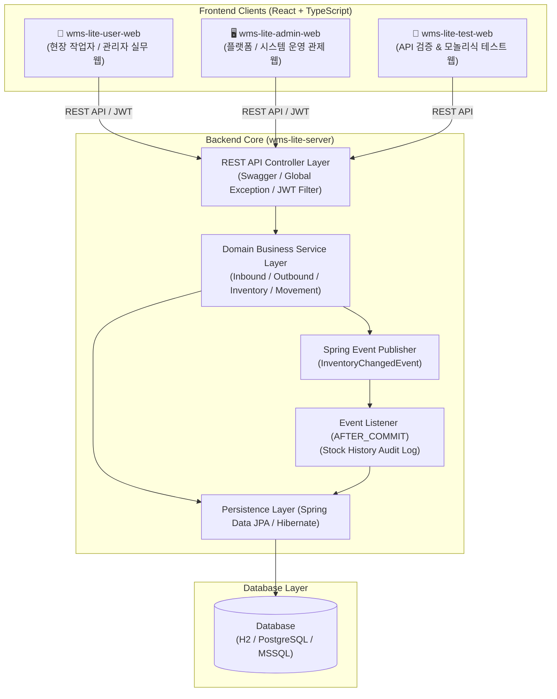
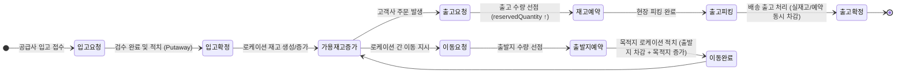
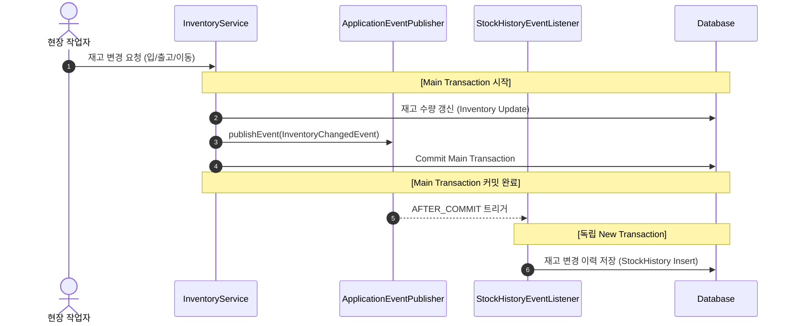
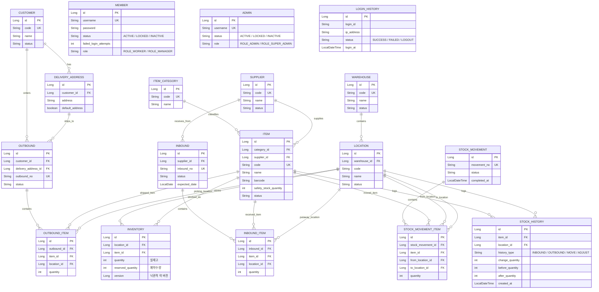

# 📦 WMS-Lite (Warehouse Management System Lite)

<div align="center">


<br/>

**Java 21 · Spring Boot · JPA 기반의 엔터프라이즈급 창고 관리 시스템(WMS) 통합 포트폴리오**  
*MES SI 3.5년 실무 도메인 경험을 바탕으로 동시성 제어, 트랜잭션 분리, 선점형 재고 관리 및 표준 아키텍처를 구현한 프로젝트입니다.*

</div>

---

## 📑 목차 (Table of Contents)

1. [프로젝트 소개 (Overview)](#-1-프로젝트-소개-overview)
2. [시스템 아키텍처 및 모듈 구성 (System Architecture)](#-2-시스템-아키텍처-및-모듈-구성-system-architecture)
3. [핵심 도메인 및 비즈니스 프로세스 (Business Logic)](#-3-핵심-도메인-및-비즈니스-프로세스-business-logic)
4. [핵심 기술적 챌린지 및 해결 전략 (Engineering Highlights)](#-4-핵심-기술적-챌린지-및-해결-전략-engineering-highlights)
5. [데이터베이스 모델링 (Database & ERD)](#-5-데이터베이스-모델링-database--erd)
6. [기술 스택 (Tech Stack)](#-6-기술-스택-tech-stack)
7. [검증 및 공개 준비 상태 (Quality Gate)](#-7-검증-및-공개-준비-상태-quality-gate)
8. [프로젝트 구조 (Directory Structure)](#-8-프로젝트-구조-directory-structure)
9. [실행 및 환경 설정 가이드 (Getting Started)](#-9-실행-및-환경-설정-가이드-getting-started)

---

## 📌 1. 프로젝트 소개 (Overview)

### 💡 기획 배경
물류 및 창고 관리 현장에서는 **수많은 다중 트랜잭션이 동시다발적으로 발생**하며, 입/출고와 재고 이동 시 **데이터 정합성(Consistency)과 가용 재고 선점 문제**가 핵심 과제입니다. 

본 프로젝트는 **3.5년의 MES SI 실무 개발 경험**에서 축적한 제조/물류 도메인 인사이트를 바탕으로, **Java 21 / Spring Boot / Spring Data JPA** 기반의 표준 백엔드 아키텍처 위에서 다음과 같은 핵심 가치를 구현했습니다:

- **가용 재고 무결성 보장**: 낙관적 락(`@Version`) 및 사전 예약 수량 검증을 통한 오버셀/중복 출고 방지
- **이벤트 기반 트랜잭션 분리**: `Spring Event` + `@TransactionalEventListener(AFTER_COMMIT)`를 활용한 감사 이력(`StockHistory`) 비동기 격리
- **엔터프라이즈 보안 및 RBAC**: Spring Security + JWT(0.12.6) 기반 무상태(Stateless) 인증 및 계정 상태(5회 실패 시 잠금) 라이프사이클 제어
- **실무형 모노레포 환경**: 백엔드 Core API와 현장 실무용 웹, 시스템 관제용 웹을 유기적으로 연동

---

## 🏗️ 2. 시스템 아키텍처 및 모듈 구성 (System Architecture)

전체 시스템은 **Monorepo** 형태로 관리되며, 백엔드 코어 API 서버와 역할별로 특화된 3개의 프론트엔드 애플리케이션으로 구성됩니다.



### 서브 프로젝트 세부 역할

| 모듈명 | 기술 스택 | 주 사용자 | 주요 기능 및 역할 |
| :--- | :--- | :--- | :--- |
| **`wms-lite-server`** | Java 21, Spring Boot 4.1, JPA, Security, JWT | Backend | 핵심 비즈니스 로직, 동시성 제어, 트랜잭션 관리, RESTful API 제공 |
| **`wms-lite-user-web`** | React 19, TypeScript 6, Vite 8 | 현장 작업자 / 현장 관리자 | 입고 적치(Putaway), 출고 피킹(Picking), 로케이션 이동, 실시간 재고 조회 |
| **`wms-lite-admin-web`** | React 19, TypeScript 6, Vite 8 | 플랫폼 / 시스템 관리자 | 마스터 기준정보(창고/로케이션/품목/거래처) 관리, 계정/권한 통제, 전체 모니터링 |
| **`wms-lite-test-web`** | React 19, TypeScript 6, Vite 8 | 개발자 / QA | 신속한 API 기능 검증 및 시나리오 테스트용 단일 페이지 |

---

## 🔄 3. 핵심 도메인 및 비즈니스 프로세스 (Business Logic)



### 도메인별 주요 책임
1. **기준 정보 (Master Data)**
   - `Customer`, `Supplier`: 고객사/공급업체 코드 중복 방지, 단일 기본 배송지(`DeliveryAddress`) 자동 스위칭 로직
   - `Warehouse`, `Location`: 창고-존-로케이션 계층 구조 모델링 및 유효성 검증
   - `Item`: 품목 카테고리, 바코드, 단위(UOM), 보관 조건 관리
2. **입고 관리 (Inbound)**
   - 고유 채번 규칙(`IB-yyyyMMdd-XXXXX`)에 따른 입고 전표 자동 생성
   - 입고 상태 머신: `REQUESTED(요청)` ➔ `COMPLETED(완료/적치)` / `CANCELED(취소)`
3. **출고 관리 (Outbound)**
   - 출고 요청 시 **가용 재고 사전 검증** 및 즉각적인 **예약 수량 선점**
   - 피킹 및 패킹 단계를 거쳐 출고 완료 시 실재고와 예약 수량 일괄 차감
4. **재고 이동 (Stock Movement)**
   - 창고 내 로케이션 간 재고 이송 시 출발지 재고 예약 ➔ 이동 완료 시 목적지 재고 증가/출발지 해제를 단일 원자적 트랜잭션으로 제어
5. **대시보드 및 공지/게시판 (Dashboard & Board)**
   - 창고별 재고 점유율, 입출고 추이 통계 API 및 현장 소통용 공지/게시판 기능 제공

---

## ⚡ 4. 핵심 기술적 챌린지 및 해결 전략 (Engineering Highlights)

### ① 낙관적 락(Optimistic Lock)을 활용한 재고 동시성 충돌 방지
- **문제 상황**: 대규모 입출고나 다중 작업자가 동일 로케이션 품목에 동시 접근 시 Dirty Read 또는 Lost Update로 인한 재고 불일치 위험 존재
- **해결 전략**: `Inventory` 엔티티에 JPA `@Version` 필드를 적용하여 애플리케이션 레벨의 낙관적 락 구현. 동시 수정 시도 시 `ObjectOptimisticLockingFailureException`을 포착하고, 비즈니스 에러로 일관되게 핸들링하여 데이터 무결성 보장

```java
@Entity
@Table(name = "inventories", uniqueConstraints = {
    @UniqueConstraint(columnNames = {"location_id", "item_id"})
})
public class Inventory extends AuditableEntity {
    @Version
    private Long version; // 동시성 제어를 위한 버전 관리

    public void reserve(int amount) {
        if (getAvailableQuantity() < amount) {
            throw new InventoryException(InventoryErrorCode.INVENTORY_RESERVE_EXCEEDED);
        }
        this.reservedQuantity += amount;
    }
}
```

---

### ② Spring Event 기반 트랜잭션 분리 및 재고 이력(Audit Log) 격리
- **문제 상황**: 재고 변경 로직과 이력(`StockHistory`) 기록 로직이 단일 트랜잭션에 묶일 경우, 이력 로깅 실패로 인해 메인 비즈니스(입출고)가 롤백되거나 성능 저하 발생
- **해결 전략**: 메인 도메인에서는 `InventoryChangedEvent`만 발행하고, 이력 저장은 `@TransactionalEventListener(phase = TransactionPhase.AFTER_COMMIT)`로 분리하여 메인 트랜잭션 커밋 완료 후 독립 트랜잭션(`REQUIRES_NEW`)으로 영속화



---

### ③ 선점형 가용 재고(`Available Quantity`) 메커니즘
- **문제 상황**: 출고 지시가 생성된 후 실제 출고 확정(배송) 전까지 시간차가 발생하며, 그 사이에 다른 주문이 동일 재고를 가로채는 오버셀(Over-allocation) 발생 가능
- **해결 전략**: 재고 상태를 `실재고(quantity)`와 `예약수량(reservedQuantity)`으로 이원화.  
  $$\text{가용 재고(Available)} = \text{실재고(Quantity)} - \text{예약수량(Reserved)}$$
  출고 요청 시 가용 재고를 검증하고 예약 수량을 즉시 증가시켜 재고를 선점하며, 출고 완료 시 실재고와 예약수량을 동시 차감하여 완벽한 정합성 유지

---

### ④ 엔터프라이즈급 계정 생명주기 및 보안 (Spring Security + JWT)
- **보안 및 인증 구조**:
  - `Member`(현장 작업자)와 `Admin`(시스템 관리자)의 인증 체계 분리
  - **로그인 5회 실패 시 자동 계정 잠금(`LOCKED`)** 처리 및 비활성화 계정(`INACTIVE`) 접근 차단
  - JWT 토큰 기반의 무상태(Stateless) 인증 및 Global Security Filter Chain 적용
  - 표준화된 API 응답 래퍼(`ApiResponse<T>`) 및 `GlobalExceptionHandler`를 통한 비즈니스 에러 코드(`ErrorCode`) 규격화

---

## 🗄️ 5. 데이터베이스 모델링 (Database & ERD)



---

### 주요 API Surface

| 영역 | 대표 경로 | 설명 |
| :--- | :--- | :--- |
| 인증/사용자 | `/api/members`, `/api/admin/admins`, `/api/admin/members` | 현장 계정, 관리자 계정, 토큰 재발급/로그아웃 |
| 기준 정보 | `/api/warehouses`, `/api/warehouses/{warehouseId}/locations`, `/api/items`, `/api/item-categories`, `/api/suppliers`, `/api/customers` | 창고, 로케이션, 품목, 거래처 마스터 |
| 입출고/재고 | `/api/inbounds`, `/api/outbounds`, `/api/inventories`, `/api/movements`, `/api/stock-histories` | 입고, 출고, 재고 조회, 이동, 이력 조회 |
| 운영 화면 | `/api/dashboard/summary`, `/api/notices`, `/api/posts` | 대시보드 요약, 공지, 자유게시판 |

---

## 🛠️ 6. 기술 스택 (Tech Stack)

### Backend
- **Core**: Java 21, Spring Boot 4.1
- **ORM / Persistence**: Spring Data JPA, Hibernate, MapStruct 1.6.3
- **Security**: Spring Security, JJWT (io.jsonwebtoken 0.12.6)
- **Database & Cloud**: Neon.tech (Cloud Serverless PostgreSQL), H2 File, MSSQL
- **Cloud Hosting & Deployment**: Railway (PaaS - Nixpacks Builder)
- **Docs & Testing**: SpringDoc OpenAPI 2.8.5 (Swagger UI), JUnit 5, Mockito
- **Build Tool**: Gradle 8.14 (Kotlin DSL)

### Frontend
- **Framework & Core**: React 19, TypeScript 6.x
- **Build Tool & Routing**: Vite 8, React Router DOM
- **Styling**: CSS Modules, Vanilla CSS (Design Tokens System)
- **Architecture**: Feature-Based Architecture

---

## ✅ 7. 검증 및 공개 준비 상태 (Quality Gate)

| 점검 항목 | 결과 | 비고 |
| :--- | :--- | :--- |
| 민감 정보 노출 점검 | PASS | 실제 운영 비밀값은 git ignore 대상으로 관리하며, 추적 파일/작업트리에서 실 DB 비밀번호·토큰 서명키 패턴 미검출 |
| Backend 테스트 | PASS | `./gradlew.bat test` 성공 |
| Frontend 빌드 | PASS | `wms-lite-user-web`, `wms-lite-admin-web`, `wms-lite-test-web` 빌드 성공 |
| Frontend 린트 | PASS | admin/test는 오류 없음, user-web은 오류 0개 및 경고 10개 |
| 의존성 취약점 | PASS | 3개 프론트 프로젝트 `npm audit --omit=dev` 기준 0 vulnerabilities |
| 운영 설정 | PASS | 운영용 설정값은 환경변수 기반으로 분리하고, 공개 저장소에는 실제 비밀값을 포함하지 않도록 정리 |

운영 공개 전 최종 확인 사항:

- 운영 DB 비밀번호와 토큰 서명키는 공개 전 한 번 회전한 뒤 배포 플랫폼의 비공개 환경변수로만 관리합니다.
- 최초 배포 후 스키마와 데이터가 안정화되면 운영 설정을 보수적으로 전환합니다.
- GitHub Pages 또는 프론트 배포 도메인이 정해지면 백엔드 CORS 허용 Origin에 반영합니다.

---

## 📁 8. 프로젝트 구조 (Directory Structure)

```text
wms-lite (Root Monorepo)
├── 📂 wms-lite-server (Backend API Server Core)
│   ├── 📂 src/main/java/com/wms/wms_lite
│   │   ├── 📂 domain
│   │   │   ├── 📂 master           # 고객사, 공급사, 품목, 창고/로케이션 마스터
│   │   │   ├── 📂 transaction      # 입고, 출고, 재고, 재고이동, 재고이력
│   │   │   ├── 📂 dashboard        # 관제 통계 및 현황 집계
│   │   │   ├── 📂 board            # 현장 공지 및 자유게시판
│   │   │   └── 📂 user             # 사용자(Member) 및 관리자(Admin) 인증/관리
│   │   └── 📂 global               # Security, JWT, Error Handling, Base Entity
│   └── 📂 src/test/java            # 도메인 단위/통합 테스트 코드
│
├── 📂 wms-lite-user-web (현장 실무자 전용 Web)
│   └── src
│       ├── 📂 pages                   # 대시보드, 입고/출고/재고/이동 작업 화면
│       ├── 📂 features                # 도메인별 비즈니스 컴포넌트 & 훅
│       └── 📂 api                     # Axios 기반 백엔드 API 클라이언트
│
├── 📂 wms-lite-admin-web (시스템 관리자 관제 Web)
│   └── src                            # 마스터 기준정보 설정, 계정 및 권한 관리 화면
│
├── 📂 wms-lite-test-web (API 통합 검증 Web)
└── 📂 docs                            # 시스템 아키텍처 및 상세 ERD/API 명세서
```

---

## 🚀 9. 실행 및 환경 설정 가이드 (Getting Started)

### 요구 사양 (Prerequisites)
- **Java**: JDK 21 이상
- **Node.js**: v20.x 이상 및 npm
- **Database**: H2 (개발 기본 내장) / 운영 DB (Neon.tech PostgreSQL)

---

### 공개 데모

- **Demo URL**: `https://redpromotion.github.io/wms-lite`
- **ID**: `sample_supervisor`
- **Password**: `SamplePassword123!`

※ 공개 데모용 계정입니다. 데모 환경은 H2 in-memory DB를 사용하며, 재배포 시 데이터가 초기화됩니다.

---

### 로컬 실행

#### 백엔드 (`wms-lite-server`)
```bash
cd wms-lite-server
./gradlew bootRun
```
* **Swagger UI (API 명세서)**: `http://localhost:8080/swagger-ui/index.html`
* **H2 Database Console**: `http://localhost:8080/h2-console` (JDBC URL: `jdbc:h2:file:./data/wms_lite_db`)

#### 프론트엔드 (`wms-lite-user-web`)
```bash
cd wms-lite-user-web
npm install
npm run dev
```
* **웹 애플리케이션 접속**: `http://localhost:5173`

---

<div align="center">
  <sub>Developed with passion for robust enterprise systems and clean backend architecture.</sub>
</div>
